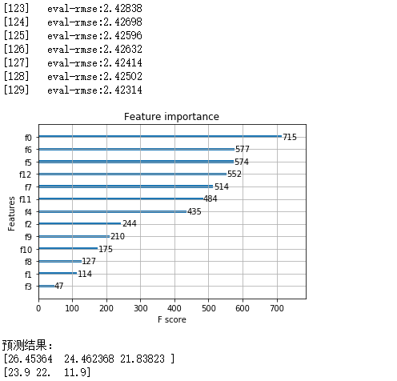

# XGBoost

[TOC]

> XGBoost是一个优化的分布式梯度增强库，旨在实现高效，灵活和便携。

## 安装

python库文件安装:`pip install xgboost`

高阶安装可以参考：[这里](https://xgboost.apachecn.org/#/docs/7)

## 简介

XGBoost，Extreme Gradient Boosting。其基于梯度提升决策树 gradient boosted tree（GBDT/GBRT/GBM）。主要应用于监督学习中，是数据比赛中常用的大杀器。

CART，分类与回归树 Classification and Regression Tree，从名字就可以看出既可以处理分类也可以处理回归问题。CART能够通过对变量进行划分来不断分裂生成一个二叉树，首先对一维数据排序，然后对排序的特征进行切分，最终的切分点由评估指标确定，分类指标为基尼指数，回归指标是最小平方和，找到切分点后生成左右子树。

### 基尼指数 Gini指数

基尼值用来描述数据集的纯度，当这个值越小的时候说明整个数据集的纯度越高。直观的说，就是随机从数据集中抽两个样本，它们的标记不一致的概率。


我们就可以计算基尼指数：


在整个属性集合中，会选择使得划分后基尼指数最小的那个属性作为最优的分割属性。

## 梯度提升树

Boosting的思想即是“三个臭皮匠赛过一个诸葛亮”，将多个弱分类器转化为强分类器。这需要怎么做呢？最简单的方法就是将多个分类器的结果进行加权。再结合到决策树就得到了提升数Boosting Tree。

以损失函数MSE为例，$min\frac{1}{N}(y-F_{(x)})^2$，对于过个不同参数的弱分类器，无法使用传统的梯度下降直接优化，故有

对于第一个弱分类器，我们的目标是$min(y-f_{1(x)})^2$；

对于第二个弱分类器，我们的目标是$min(y-f_{1(x)}-f_{2(x)})^2$；

对于第t个弱分类器，我们的目标是$min(y-f_{1(x)}-f_{2(x)}-...-f_{t(x)})^2$；

那么，对于第t+1个弱分类器，我们的目标是$min(y-f_{1(x)}-f_{2(x)}-...-f_{t(x)}-f_{t+1(x)})^2$，令$y-\sum^t_{i=1}f_{i(x)}$为r，则有

$$(y-\sum^t_{i=1}f_{i(x)}-f_{i+1(x)})^2 =(r-f_{i+1(x)})^2<(y-\sum^t_{i=1}f_{i(x)})^2$$

即，$L(y,\sum^t_(i=1)f_{(x)}+f_{i+1(x)})<L(y,\sum^t_{i=1}f_{(x)})$

这就得到了提升树算法。

虽然这样能解决优化问题，但是对于其他一些损失函数，这种方法并不是很友好，有些情况下很难再去进行残差拟合了，所以就有了梯度提升树。重新回到我们的目标，最小化$L(y,F_{(x)})$，似乎我们只要$L(y,\sum^t_{i=1}f_{i(x)}+f_{i+1(x)})$比$L(y,\sum^t_{i=1}f_{(x)})$小就可以了。那么就可以重新定义损失函数为：

$$max[L(y,\sum^t_{i=1}f_{(x)})-L(y,\sum^t_{i=1}f_{i(x)}+f_{i+1(x)})]$$

令$c=\sum^t_{i=1}f_{i(x)}$，由泰勒公式的二阶展开可以有：

$$L(c+f_{i+1(x)})\approx L(c)+L^{’}(c)f_{i+1(x)}=L(c)-L^{’}(c)^2<L(c)$$

就有了$f_{i+1(x)}=-1*L^{’}(c)$，即$-[\frac{\partial L(y_i,f_(x_i)}{\partial f_{x_i}}]$，于是就产生了梯度提升树。

## XGBoost

XGBoost与GBDT有两点差异，**XGBoost的导数不是一阶的，而是二阶的**；还进行了正则项进行了改进，**XGBoost的剪枝在对叶子的个数做惩罚的同时还加入了权重惩罚**。

### XGBoost的二阶梯度

$$L(x+\delta x)\approx L(x)+L'(x)\delta x+\frac{1}{2}L''(x)\delta x^2=L(x)-\frac{1}{2}\frac{L'(x)^2}{L''(x)}<L(x)$$;

其中$\delta x=-\frac{L'(x)}{L''(x)}$

### XGBoost的正则项

GBDT为了控制树的复杂度会对树的叶子数进行正则控制，XGBoost不仅把叶子数加入正则，还把每个叶子节点的权重加入了正则。

$$Loss=\sum^N_{i=1}L(y_i,F_{(x_i)}+\Omega(F))，其中，\Omega(F)=\gamma\sum^M_{i=1}T_i+\frac{1}{2}\lambda\sum_iw_i^2$$

T表示叶子节点的个数，w表示这个叶子节点的权重。

## 参数说明

### 常规参数

* **booster **[default=gbtree]：选择使用的booster，可以是gbtree、gblinear和dart，其中gbtree和dart是基于树的模型，dart多在了dropout，gblinear则是线性分类模型。
* **silent** [default=0]：0状态下会打印出运行信息，1则是静默。
* **nthread** ：默认使用尽可能多的进程数。

### Tree的参数

* **eta** [default=0.3]：即learning_rate。[0,1]之间。
* **gamma** [default=0]：在树的叶子节点上进一步划分的最小损失量，值越大，算法就越保守。[0,+∞]之间。
* **max_depth** [default=6]：最大树深，越大越容易过拟合。[1,+∞]之间。
* **min_child_weight** [default=1]：树构建过程中，当节点的权重小于这个值则分支会被丢弃，值越大，算法越保守。[0,+∞]之间。
* **subsample** [default=1]：样本的采样比例，值越大，越容易过拟合。(0,1]之间。
* **colsample_bytree** [default=1]：构建每棵树时列的采样比率。(0,1]之间。
* **colsample_bylevel** [default=1]：每一级的每一次分裂的采样比率。(0,1]之间。
* **lambda** [default=1]：L2正则。
* **alpha** [default=0]：L1正则。
* **scale_pos_weight** [default=0]：控制样本平衡。典型值：sum(negative cases) / sum(positive cases)。

## 使用方法

XGBoost的实现有原生版本，同时也有Scikit-learn版本，两者在使用上有一些微差异，这里给出原生XGBoost实现多分类、回归问题的例子。

### iris分类问题

```python
import xgboost as xgb
from xgboost import plot_importance
from sklearn.datasets import load_iris
from sklearn.model_selection import train_test_split
import matplotlib.pyplot as plt
import numpy as np

iris = load_iris()
x = np.array(iris.data)
y = np.array(iris.target)
x_test = x[-3:,:]
y_test = y[-3:]
x_train, x_valid, y_train, y_valid = train_test_split(x[:-3,:], y[:-3], test_size=0.2)
train = xgb.DMatrix(x_train, label=y_train)
valid = xgb.DMatrix(x_valid, label=y_valid)
test = xgb.DMatrix(x_test, label=y_test)
# 参数设置
params = {
    'booster': 'gbtree',
    'objective':'multi:softmax',
    'num_class': 3,
    'max_depth':6,
    'eta':0.1,
    'silent':1,
    'gamma':0,
    'min_child_weight':1,
    'subsample':1,
    'colsample_bytree':1,
    'colsample_bylevel':1,
    'lambda':1,
    'alpha':0,
    'nthread':-1,
    'eval_metric':'merror',
    'seed':0
}
# 验证集
evallist  = [(valid,'eval')]
# 模型训练
model = xgb.train(params.items(), train, 10, evals=evallist)
# 特征重要性
plot_importance(model)
plt.show()
# 预测
res = model.predict(test)
print('预测结果：')
print(res)
print(y_test)
```

运行结果如下：


###  Boston房价回归问题

```python
import xgboost as xgb
from xgboost import plot_importance
from sklearn.datasets import load_boston
from sklearn.model_selection import train_test_split
import matplotlib.pyplot as plt
import numpy as np
# 加载数据
boston = load_boston()
x = np.array(boston.data)
y = np.array(boston.target)
x_test = x[-3:,:]
y_test = y[-3:]
x_train, x_valid, y_train, y_valid = train_test_split(x[:-3,:], y[:-3], test_size=0.2)
train = xgb.DMatrix(x_train, label=y_train)
valid = xgb.DMatrix(x_valid, label=y_valid)
test = xgb.DMatrix(x_test, label=y_test)
# 参数设置
params = {
    'booster': 'gbtree',
    'objective':'reg:linear',
    'max_depth':6,
    'eta':0.1,
    'silent':1,
    'gamma':0,
    'min_child_weight':1,
    'subsample':1,
    'colsample_bytree':1,
    'colsample_bylevel':1,
    'lambda':1,
    'alpha':0,
    'nthread':-1,
    'eval_metric':'rmse',
    'seed':0
}
# 验证集
evallist  = [(valid,'eval')]
# 模型训练
model = xgb.train(params.items(), train, 100, evals=evallist)
# 特征重要性
plot_importance(model)
plt.show()
# 预测
res = model.predict(test)
print('预测结果：')
print(res)
print(y_test)
```

运行结果如下：


对比两段代码，其实它们的差别并不特别大，差异主要是一些参数上的设置，如objective，可以是'reg:linear'、'reg:logistic'、'binary:logistic'、'multi:softmax'、'multi:softprob'等等，此外，评估方法eval_metric 也会有相应区别，如'rmse'、'mae'、'logloss'、'error'、'merror'、'auc'等等，更多参数都可以查看[这里](https://xgboost.apachecn.org/#/docs/15)。XGBoost的默认参数很难达到最好的效果，所以接下来需要进一步的调参。

## 参数调优

XGBoost调参主要用到其CV方法以及sklearn中的GridSearchCV、RandomizedSearchCV方法。这里继续以Boston房价为例。

首先，为了提高效率，设置eta为一个较大的值，确定其迭代次数，最后的时候再调小这个参数，进一步提高准确率。

```python
params = {
    'booster': 'gbtree',
    'objective':'reg:linear',
    'max_depth':6,
    'eta':0.1,
    'silent':1,
    'gamma':0,
    'min_child_weight':1,
    'subsample':1,
    'colsample_bytree':1,
    'colsample_bylevel':1,
    'lambda':1,
    'alpha':0,
    'nthread':-1,
    'eval_metric':'rmse',
    'seed':0
}
cv = xgb.cv(params, train, num_boost_round=10000, nfold=3, metrics='rmse', early_stopping_rounds=10, seed=0)
print('Best round：',cv.shape[0])
print('Best score：',cv.values[-1,:])
```

运行结果：


从结果可以看出，eta=0.1的条件下，最优迭代次数是：70次，把相应的参数如此设置。

接下来使用GridSearchCV调其他参数，调整其他参数需要使用sklearn下的XGBoost。

```python
from sklearn.model_selection import GridSearchCV
from sklearn.metrics import mean_squared_error

# 模型训练
model = xgb.XGBRegressor(max_depth=9, learning_rate=0.1, n_estimators=130, silent=True, 
                         objective='reg:linear', nthread=-1, gamma=0.1, min_child_weight=0, 
                         max_delta_step=0, subsample=0.5, colsample_bytree=0.8, colsample_bylevel=0.4, 
                         reg_alpha=0.4, reg_lambda=0.8, scale_pos_weight=1, base_score=0.5, seed=0, 
                         missing=None)
model.fit(x_train,y_train)
val = model.predict(x_valid)
print(mean_squared_error(y_valid,val))
res = model.predict(x_test)
print('预测结果：')
print(res)
print(y_test)

para = {
#     'learning_rate':[0.3,0.1,0.05,0.03,0.01],
#     'n_estimators':np.arange(50,200,20),
#     'max_depth':np.arange(3,10,1),
#     'gamma':np.arange(0.1,1,.1),
#     'min_child_weight':np.arange(0,5,1),
#     'subsample':np.arange(0.3,1,.1),
#     'colsample_bytree':np.arange(0.3,1,.1),
#     'colsample_bylevel':np.arange(0.3,1,.1),
#     'reg_alpha':np.arange(0,0.5,.1),
#     'reg_lambda':np.arange(0.5,1,.1),
}
cv = GridSearchCV(estimator=model,param_grid=para,scoring='neg_mean_squared_error',cv=5,verbose=1,n_jobs=-1)
cv.fit(x_train,y_train)
print("Best params:",cv.best_params_)
print('Best score:',cv.best_score_)
```

最后调整结果如下图，明显比默认情况有进一步提升，对于参数联调时运行效率问题，可以使用RandomizedSearchCV来降低计算量：



总结一下调参步骤:

1. 定义初始变量，首先选定初始learning_rate，确定迭代次数；
2. GridSearchCV调整max_depth和min_child_weight；
3. 调整gamma值；
4. 调整subsample、colsample_bytree和colsample_bylevel；
5. 调整alpha、lambda；
6. 重新调整learning_rate，重新确定迭代次数；

## GBDT、XGBoost、LightGBM对比

**GBDT**

* 可以灵活处理各种数据，简单调整即可有不错的结果；
* GBDT是Boosting的，很难并行训练数据；

**XGBoost**

* XGBoost支持多样，并加入了正则项，支持shrinkage缩减（相当于学习率），增加了列抽样来防止过拟合，能够处理缺失值，并且支持并行；
* level-wise的建树方式对一层中所有叶子节点一视同仁，有些叶子节点影响并不大，加重了计算，还有就是预排序会消耗很大空间，且要保存特征的排序索引，消耗很多时间，计算量大；

**LightGBM**

* 内存和计算上相对XGBoost有明显优势，支持多线程优化，支持直接输入类别特征；
* leaf-wise的建树策略很容易过拟合，需要限制最大深度；

## 常见问题

**XGBoost防止过拟合的方法**

* 目标函数添加了正则项，包括叶子节点个数、叶子节点的权重；
* 列抽样，即在训练的过程中只使用一部分特征；
* 子采样，即每轮计算可以不适用全部样本；
* shrinkage，即学习率，为后面的训练开辟更多学习空间；

**XGBoost中的一棵树停止生长的条件**

* 一次新的分裂的节点Gain指数小于0时，放弃这次分裂；
* 当达到醉倒树深时；
* 一次分裂后，重新计算新生成的左右叶子节点的样本权重和，如果叶子节点的样本权重小于阈值，放弃这次分裂；

**XGBoost如何对树进行剪枝**

* 目标函数加入正则项；
* 引入一个阈值，当分裂后增益低于该值，则不分裂；
* 先自定到底建树，后自地向顶检查是否满足分裂条件，进行剪枝；

## 参考

* https://xgboost.apachecn.org/#/
* https://blog.csdn.net/u013709270/article/details/78156207
* https://juejin.im/post/5b7669c4f265da281c1fbf96
* [https://github.com/dayeren/Kaggle_Competition_Treasure/blob/master/Models/XGBoost/XGBoost_%E5%8E%9F%E7%90%86%E8%AE%B2%E8%A7%A3.ipynb](https://github.com/dayeren/Kaggle_Competition_Treasure/blob/master/Models/XGBoost/XGBoost_原理讲解.ipynb)
* https://blog.csdn.net/data_scientist/article/details/79022025
* https://mp.weixin.qq.com/s/_NCKAon-megJbxzV6w3aYg
